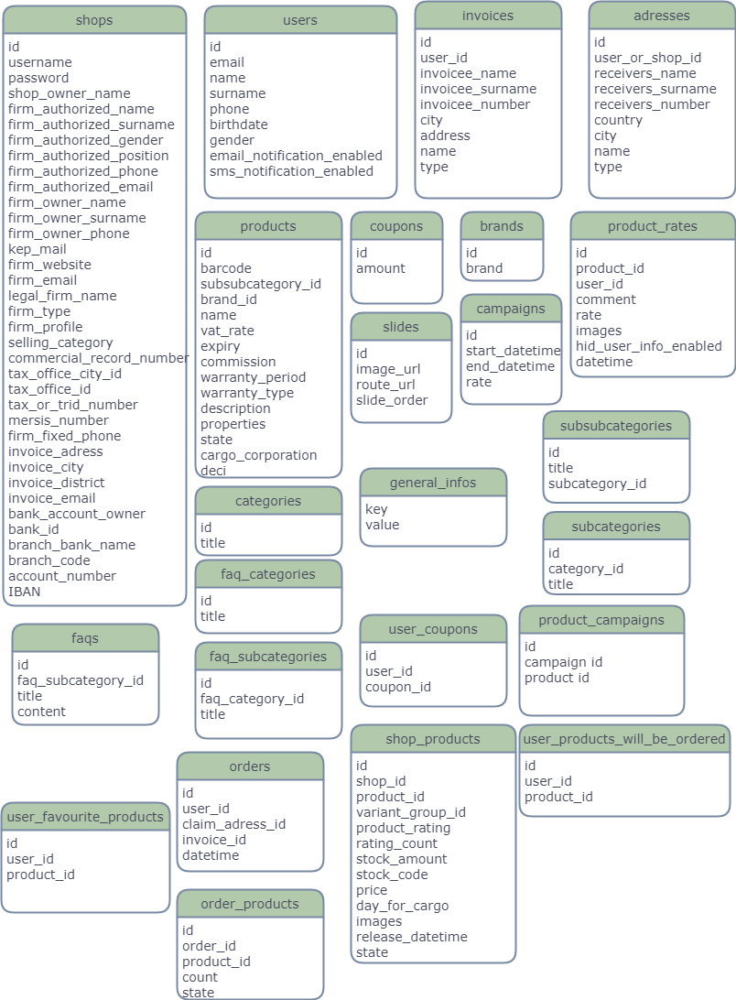
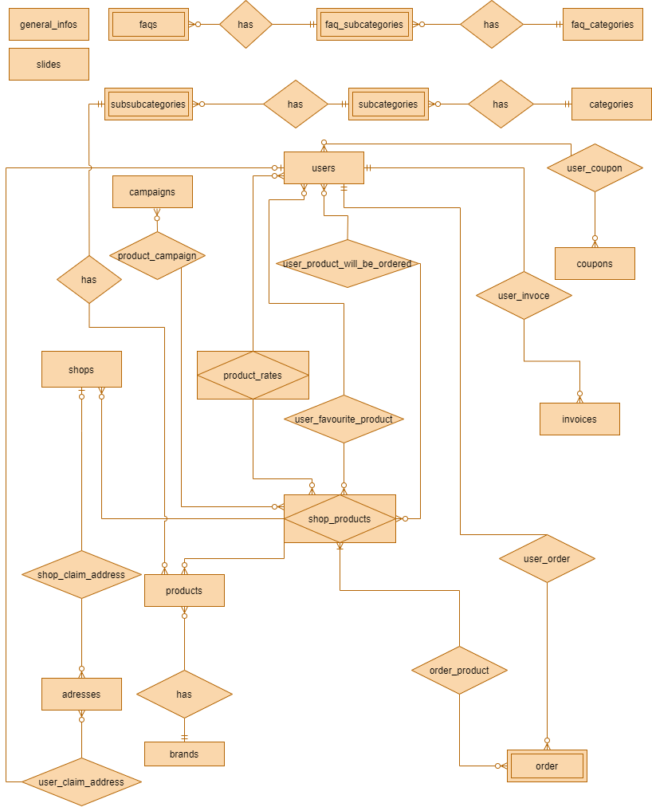

### Project Information
--- 
* Project Name:  
E-Commercial
 

* Project Team:  
Fadıl Şahin 
 

* Project Start Date:  
October 2020
 

* Project State And Duration:  
Cancelled,

This projet is massive to deal with. Learning is a continuous process and learning everything at once while doing a project can only cause using technologies and tools within a framework or language. It is much more important to learn concepts, problems and solutions which are reason to come out of related software technologies and tools day by day in needed deep. So, It will be more effective way to learn with more than one smaller projects for specific situations associated with the tools and technologies.
 

* Project Description:  
This project is clone of amazon website. In this project, I am going to built web API as a backend and the frontend side is going to be working on browser and mobile. In this application, same functionalities are going to exist as much as possible. There are going to be various frameworks, databases, libraries used in this project because main purpose of doing this project is about to experience and practise all written below. Also there are going to be ORMs, IoC containers, logging, caching etc.
**Things will be used in the project:** 
    | Database | Back-end | Front-end | Mobile Front-end |
    | :-: | :-: | :-: | :-:
    | Postgresql | Asp .Net Core | Angular | Flutter|
    | Mysql | Spring Boot | React | React Native |
 
 

## Database Schemas
- - - -

## Database ERD Diagram
- - - -

:exclamation: To See ***[Database Tables, table fields and field types and constraints](Info/Database%20Design.txt "Database Design.txt")*** click and scroll to the end

>End of the design! In the next days new tables and updates will be implemented to database directly without documentate! Database will be shared directly as [ecommercial.sql](Info/ecommercial.sql "Database Dump File") file.

